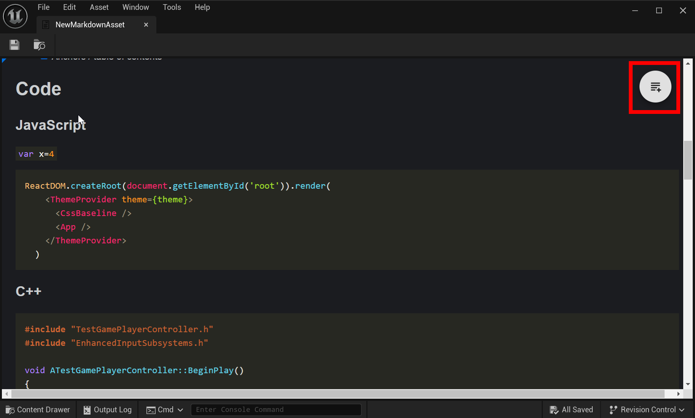
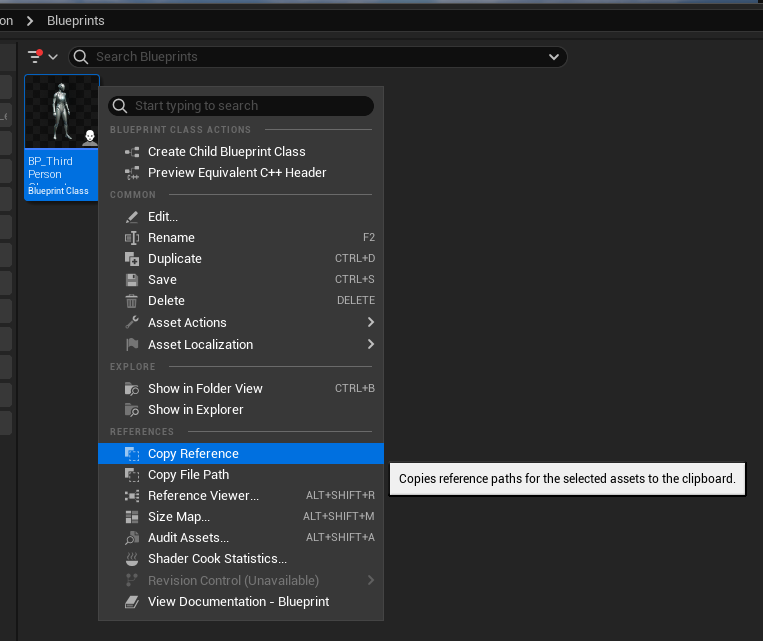
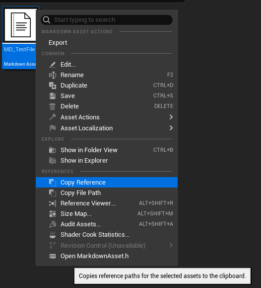

# Markdown Asset

A plugin for the Unreal game engine that adds Markdown as a new asset type.

> Unreal tested versions
> * 5.3
> * 5.4
> * 5.5

This allows you to create and manage documentation directly within the engine. This is particularly useful for personal projects and prototyping when you want to keep documentation with the project.

## How to install

1. Clone this repo into your project's `Plugins` folder.
2. Build your project
3. Enable the Web Browser plugin (`Edit -> Plugins` from the menu)
4. Enable the Markdown Asset plugin (`Edit -> Plugins` from the menu)

## How to use

### Create an asset

* Right click in the content browser
* `Documentation -> Markdown Asset`


### Edit an asset

* Double click the asset to edit
* This will open the asset in the editor
* You can switch between the editor and preview mode using the button in the top right



### Settings

* You can swap between a light and dark skin in the editor preferences
* Edit -> Editor Preferences -> Plugins -> Markdown Asset

## Unreal Engine Links integration

The plugin uses the UAssetEditorSubsystem from the engine to open any asset from a link to it.

You can add links to your project assets, C++ file or even specific functions of a C++ class.


### How to link anything

You can directly copy and paste a reference to any asset or C++ file from the editor




Because Markdown files are assets too, you can reference them too! very useful to build one big index for your systems documentations



You can specify a function in a class link by adding ".FunctionName" at the end, right before the last "'" character. When clicked, the default IDE will show the class at the specific function.

i.e: to link the GetOwnerActor function inside the GameplayTask class the link is:

/Script/CoreUObject.Class'/Script/GameplayTasks.GameplayTask.GetOwnerActor'

### Anatomy of a link to an asset

There are two important parts to link something from the engine: should starts with **"/Script"** and the actual link should be between two **'** characters after that.

#### Examples of Valid links:

/Script/CoreUObject.Class'/Script/GameplayTasks.GameplayTask.GetOwnerActor'

/Script '/Game/ThirdPerson/Maps/ThirdPersonMap.ThirdPersonMap'

### Hermes

Also supports [Hermes](https://github.com/jorgenpt/Hermes) and [RedTalaria](https://github.com/cdpred/RedTalaria) deeplinks.

## Markdown Extensions

The editor runs inside the unreal web browser client. Under the hood it is using [markdown-it](https://github.com/markdown-it/markdown-it) and I've enabled a bunch of plugins that extend the markdown syntax.

### Syntax Highlighting

Should be automatic for code blocks. You can specify the language like this:

```cpp
#include "TestGamePlayerController.h"
#include "EnhancedInputSubsystems.h"

void ATestGamePlayerController::BeginPlay()
{
    Super::BeginPlay();
}
```

### Tasks Lists

Are added like this:

```markdown
- [x] fix closing browser warning
- [x] add custom icon
- [ ] better editing experience
- [ ] add dark and light themes
```

Which gives this:

- [x] fix closing browser warning
- [x] add custom icon
- [ ] better editing experience
- [ ] add dark and light themes

### Anchors

Headings are automatically given anchors, so you can link to them like this:

```markdown
[Link](#ignore-extra-cells)
```

will jump to ...

## Ignore extra cells

### Table of Contents

You can automatically add a table of contents to your document like this:

```markdown
[[toc]]
```

### MathJax

You can add math equations with [MathJax](https://www.mathjax.org/) by wrapping them with `$` or `$$`:

#### Inline

```markdown
$e^{i\pi} - 1 = 0$
```

#### Block

```markdown
$$
\left( \frac{\partial^2}{\partial x^2} + \frac{\partial^2}{\partial y^2} \right) {| \varphi(x+ i y)|}^2 = 0
$$
```

Gives ...

$e^{i\pi} - 1 = 0$

$$
\left( \frac{\partial^2}{\partial x^2} + \frac{\partial^2}{\partial y^2} \right) {| \varphi(x+ i y)|}^2 = 0
$$

### Diagrams

Diagrams can be added with [GraphViz](https://graphviz.org/Gallery/directed/) (see [markdown-it-textual-uml](https://github.com/manastalukdar/markdown-it-textual-uml) for details).

For example:

```plantuml
Bob -> Alice : hello
```

```dot
digraph example1 {
    1 -> 2 -> { 4, 5 };
    1 -> 3 -> { 6, 7 };
}
```

Which gives this:

Bob -> Alice : hello

digraph example1 {
    1 -> 2 -> { 4, 5 };
    1 -> 3 -> { 6, 7 };
}

PlantUML and Dot diagrams work fine. Ditaa and Mermaid, not so much.

### Videos

You can embed videos from YouTube and Vimeo like this:

```markdown
@[youtube](tgbNymZ7vqY)
@[youtube](http://www.youtube.com/embed/tgbNymZ7vqY)
```