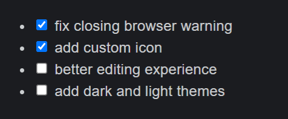

# Markdown Asset

> * Tested on UE 5.3
> * Note this also requires the Web Browser plugin to be enabled.

This adds markdown as an asset to Unreal.

Behold, the latest game-changing feature in Unreal: Markdown! Why, you ask? Because sometimes, in the wild world of side projects, you need to document your midnight musings right where the magic happens – in the game editor itself! Now, you can scribble notes amid your digital dragons and spaceships. Genius or madness? Jury's still out. Really, I just fancied coding my own asset type for giggles. Any regrets? A smidge. But hey, it's done now. If others find it useful, brilliant! If not, at least my cat appreciates the extra keyboard time.

## How to install

1. Clone this repo into your project's `Plugins` folder.
2. Build your project
3. Enable the Web Browser plugin (`Edit -> Plugins` from the menu)
4. Enable the Markdown Asset plugin (`Edit -> Plugins` from the menu)

Hopefully that should work.

## How to use

### Create an asset

* In the content browser
* Right click -> Miscellaneous -> Markdown Asset


### Edit an asset

* Double click the asset to edit
* This will open the asset in the editor
* You can switch between the editor and preview mode using the button in the top right


### Settings

* You can swap between a light and dark skin in the editor preferences
* Edit -> Editor Preferences -> Plugins -> Markdown Asset

## Markdown

The editor runs inside the unreal web browser client. Unfortunately, this seems to be restricted and certain features are not present.

However, under the hood it is using [markdown-it](https://github.com/markdown-it/markdown-it) and I've enabled a bunch of plugins that extend the markdown language with some extra useful features, listed below:

### Syntax Highlighting

Should be automatic for code blocks. You can specify the language like this:

    ```c++
    #include "TestGamePlayerController.h"
    #include "EnhancedInputSubsystems.h"

    void ATestGamePlayerController::BeginPlay()
    {
        Super::BeginPlay();
    }
    ```

### Tasks Lists

Are added like this:

```markdown
- [x] fix closing browser warning
- [x] add custom icon
- [ ] better editing experience
- [ ] add dark and light themes
```

Which gives this:




### Anchors

Headings are automatically given anchors, so you can link to them like this:

```markdown
[Link](#ignore-extra-cells)

will jump to ...

## Ignore extra cells
```

### Table of Contents

You can automatically add a table of contents to your document like this:

```markdown
[[toc]]
```

### Diagrams

[PlantUML](https://plantuml.com/) and [Dot](https://en.wikipedia.org/wiki/DOT_(graph_description_language)) diagrams seem to work. Unfortunately [Mermaid](https://mermaid.js.org/) diagrams seem to be broken by the Unreal Web Brower limitations.

You add them like this:


    ```plantuml
    Bob -> Alice : hello
    ```

    ```dot
    digraph example1 {
        1 -> 2 -> { 4, 5 };
        1 -> 3 -> { 6, 7 };
    }
    ```

Which gives this:


See [markdown-it-textual-uml](https://github.com/manastalukdar/markdown-it-textual-uml) for more details.

## Notes

**NB:** You probably do not want to ship with your documentation. Make sure the markdown assets are not included in your build!

Unfortunately, support for MathJax and playing videos does not work with limitations of the Unreal web browser plugin.

GL & HF

